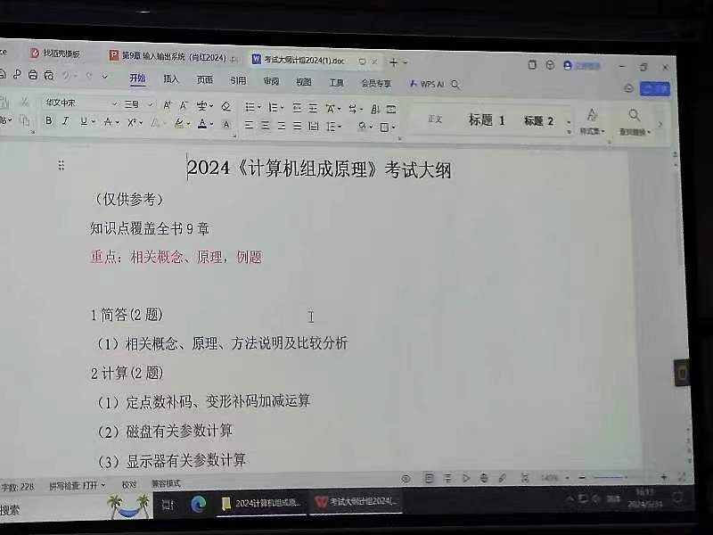
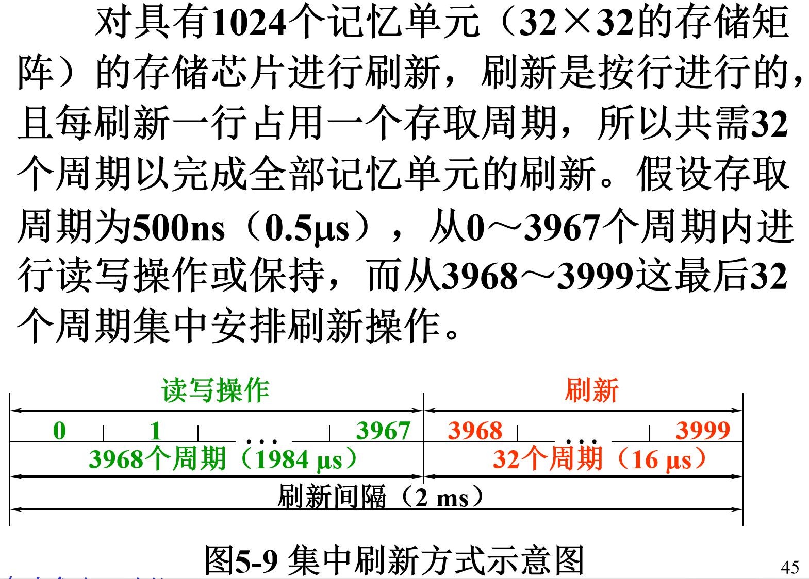
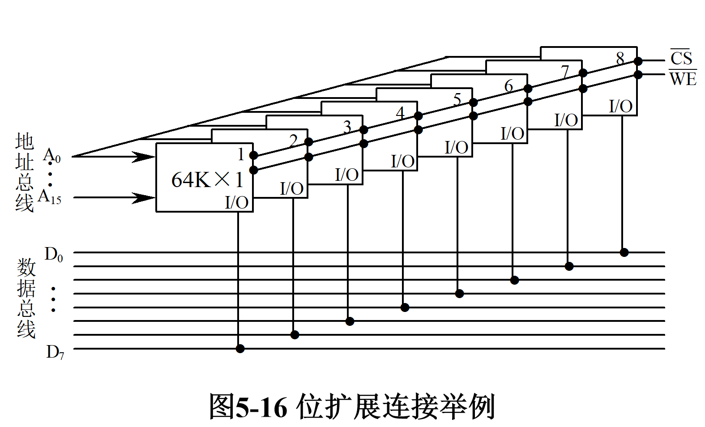
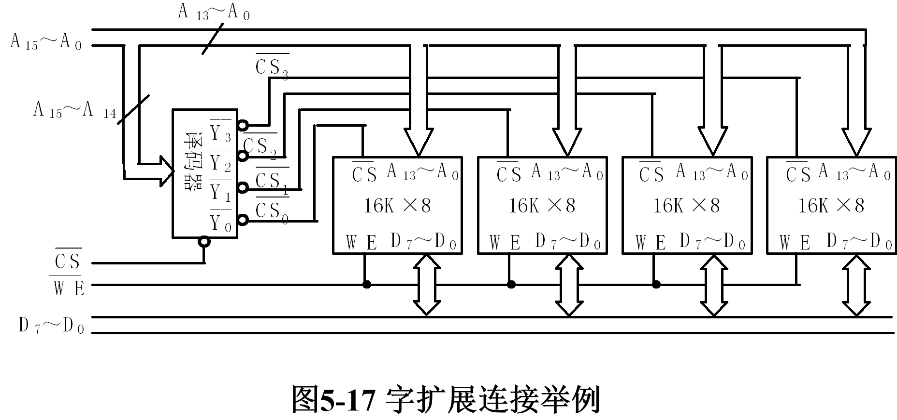
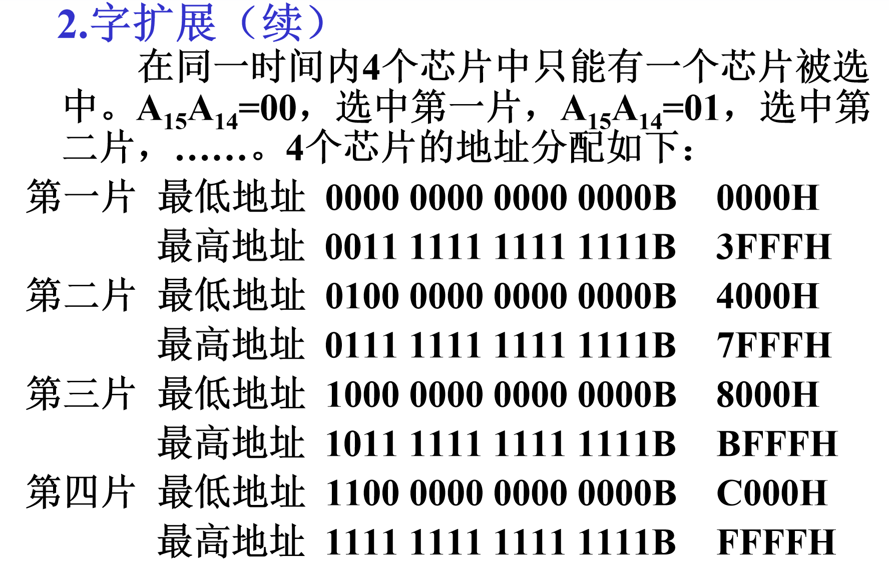
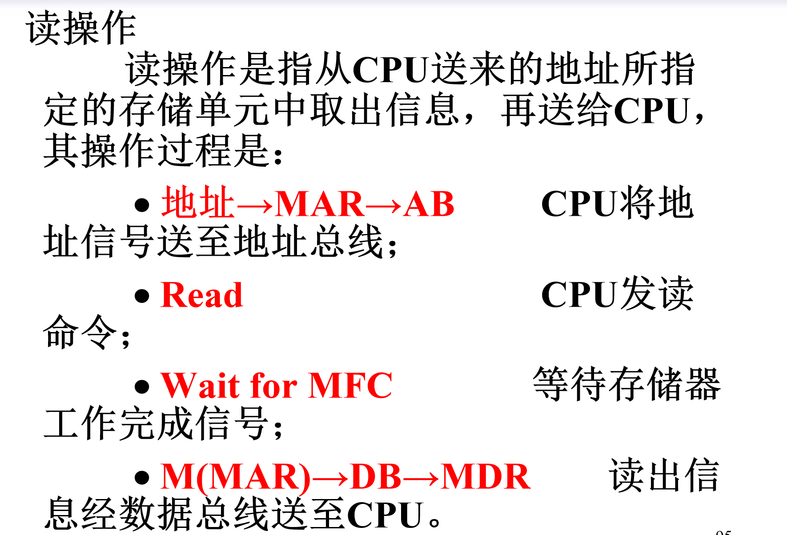
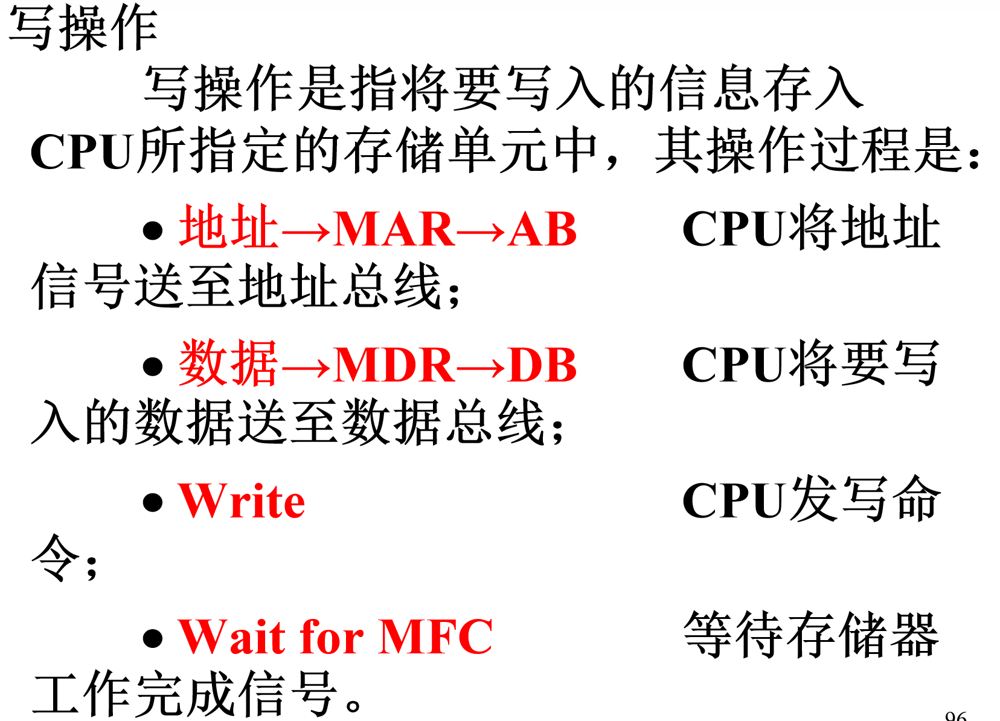

# 计算机组成原理复习

## 叙述

本人是大二GDUT的学生，整理这篇笔记是纯属是临时抱佛脚，主要更适合于学习过一遍这门课程并且需要一个知识大纲的学生，如果您之前没有学习过这门课程希望您可以对照每个知识点看一遍老师的PPT，这样会更好一点。这样比起你每个章节都记录了老师PPT的学习要求。如有错误，请指出🙌。下图附2024年春的计算机组成原理考试范围，本笔记对于==了解==的知识会一概而过或者直接略过，而==理解==和==掌握==的知识点会着重讲述，这其中已经涵盖了考点。

## 第五章 存储系统和结构

### 5.1 存储系统的组成

了解：存储器的分类方法和存储系统的层次

### 5.2 主存储器的组织

==理解：主存储器的基本结构、存储单元和主存储器的主要技术指标==

==掌握：数据在主存中的存放方式==

1. 主存储器的基本结构

* 主存通常由存储体、地址译码驱动单路、I/O和读写电路组成

2. 存储单元

3. 主存储器的主要技术指标

* 存储容量
* 存取速度
  * 存取时间：从启动一次存储器操作到完成该操作所经历的时间
  * 存取周期：主存进行一次完整的读写操作所需的全部时间，即连续两次访问存储器操作之间所需要的最短时间。
  * 主存带宽：又称为数据传输率，表示每秒从主存进出信息的最大数量，单位为字每秒或字节每秒或位每秒。
* 可靠性：在规定时间内，存储器无故障读写的概率。
* 功耗：反映了存储器件耗电的多少

4. 数据在主存中的存放方式

* 不浪费存储器的存放方法：数据一个紧接一个的存放
* 从存储字的起始位置开始存放的方法
* 边界对齐的数据存放方法：

### 5.3 半导体随机存储器和只读存储器

了解：半导体随机存储器（静态RAM和动态RAM）的基本存储原理

理解：动态RAM的刷新

了解：RAM芯片的基本结构

理解：各种不同类型的ROM

==主存储器通常可分为RAM和ROM两大部分。RAM可读可写，ROM只能读不能写。==

1. 静态RAM和动态RAM

RAM又可分为静态RAM，即SRAM和动态RAM，即DRAM

* SRAM：存取速度快，但集成度低，功耗也较大。所以一般用来组成高速缓冲存储器和小容量主存系统。

* DRAM：集成度高，功耗小，但存储系统满。一般用来组成大容量主存系统。

2. 动态RAM的刷新（区分刷新和重写的概念）

* 刷新间隔：2ms或者4ms

* 刷新方式

  * 集中刷新方式：优点：读写操作时间不受刷新工作的影响，因此系统的存取速度比较高。缺点：集中刷新期间必须停止读写。
  * 分散刷新方式：
  * 异步刷新方式

  

​	

* 刷新控制：为了控制刷新，往往需要增加刷新控制电路。

3. RAM芯片的基本结构

RAM芯片通过地址线（单向）、数据线（双向）和控制线与外部连接

4. 各种不同类型的ROM

* 掩膜式ROM（MROM）：内容由半导体制造厂按用户要求在芯片生产中直接写入，任何人无法改变其内容。优点：可靠性高，集成度高，形成批量后价格便宜。缺点：用户对制造厂依赖过大，灵活性差。
* 一次可编程ROM（PROM）：允许用户利用专门的设备（编程器）写入自己的程序，一旦写入无法改变。
* 可擦除可编程ROM（EPROM）：用户可以利用编程器写入信息，而且可以对齐内容进行多次改写。其可分为两种：紫外线擦除（UVEPROM）和电擦除（EEPROM）。

* 闪速存储器：既可在不加电的情况长期保存信息，又能在线进行快速擦除与重写。兼备EPROM和RAM的优点。

### 5.4 主存储器的连接与控制

==掌握：主存储器容量的各种扩展方式==

==理解：主存储器和CPU的硬连接==

1. 位扩展

如用64K × 1的SRAM的芯片组成64K × 8 的存储器，所需芯片数为：8

* 8个芯片的地址线A15 ~ A0分别连在一起
* 各芯片的片选信号~~CS~~以及读写控制信号~~WE~~也都分别连接到一起
* 只有数据线D7 ~ D0 各自独立，每片代表一位

2. 字扩展

用16K × 8的SRAM组成的64K × 8的存储器，所需芯片数为：4

* CPU提供16根地址线，8根数据线；存储芯片仅有14根地址线，8根数据线
* 四个芯片的地址线A13 ~ A0 、数据线D7 ~ D0 及读写控制信号~~WE~~ 都是同名信号并联在一起
* 高地址线A15 、A14 经过一个地址译码器产生四个片选信号~~CS~~i ，分别选中四个芯片中的一个

3. 字和位同时扩展

**主存和CPU之间的连接**

主存和CPU的硬连接由3组连线：

1. 地址总线(AB)
2. 数据总线(DB)
3. 控制总线(CB)

MAR：可以接受来自程序计数器（PC）的指令地址或来自运算器的操作数地址，以确定要访问的单元

MDR：向主存写入、读出的数据的缓冲部件

主存和CPU之间的软连接：CPU向主存发出的读或写命令，这才是两个部件之间的有效工作的关键。

## 第六章 中央处理器

### 6.1 中央处理器的功能和组成

==理解：CPU的功能和主要寄存器==

CPU的功能：对指令流和数据流在时间与空间上实施正确的控制

CPU的主要寄存器：

1. 通用寄存器
   * 累加寄存器
2. 专用寄存器
   * 程序计数器（PC）
   * 指令寄存器（IR）
   * 存储器数据寄存器（MDR）
   * 存储器地址寄存器（MAR）
   * 状态标志寄存器（PSWR）

### 6.2 控制器的基本组成

==理解：控制器的基本组成==

#### 6.2.1 控制器的基本组成

1. 指令部件：完成取值并分析指令。
2. 时许部件：产生一定的时序信号。
3. 微操作信号发生器：也称为控制单元（CU）。
4. 中断控制逻辑：用来控制中断处理的硬件逻辑。

#### 6.3 时序系统与控制方式

==理解：时许系统中指令周期、机器周期的概念==

了解：不同的控制方式（同步、异步、联合）

==理解：指令执行的基本过程==

指令周期：从取指令、分析取数到执行完该指令所需的全部时间。

机器周期：又称为CPU周期。通常把一个指令周期划分位若干个机器周期。每个机器周期完成一个基本操作。一般机器的CPU周期有**取值周期**、**取数周期**、**执行周期**、**中断周期**等。

​				          ==指令周期 \= i × 机器周期==

#### 6.3.3 指令执行的基本过程

1. 取指令阶段

* (PC) -> MAR, (PC) -> AB(地址总线)
* 由控制单元（CU）经控制总线（CB）向存储器发读命令
* 从主存中取出的指令通过数据总线（DB）送到存储器数据寄存器（MDR）
* 将MDR中的内容送到指令寄存器（IR）
* 将pc+1

2. 分析取数阶段

3. 执行阶段

