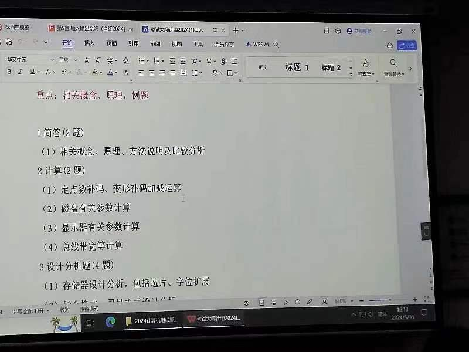
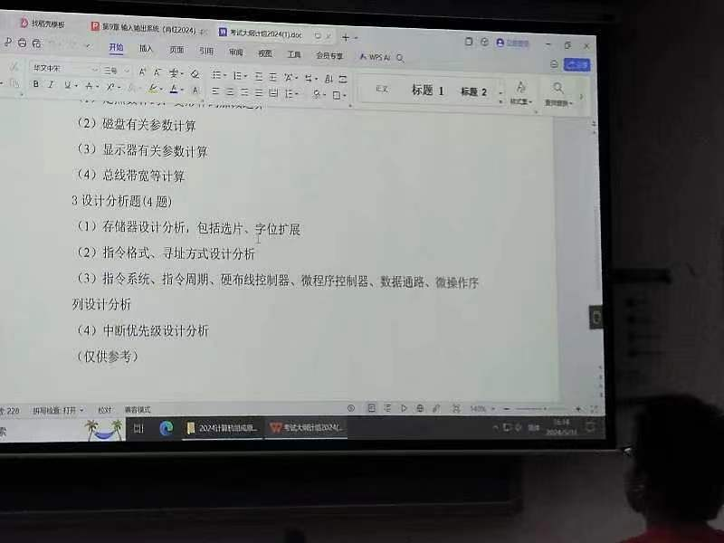
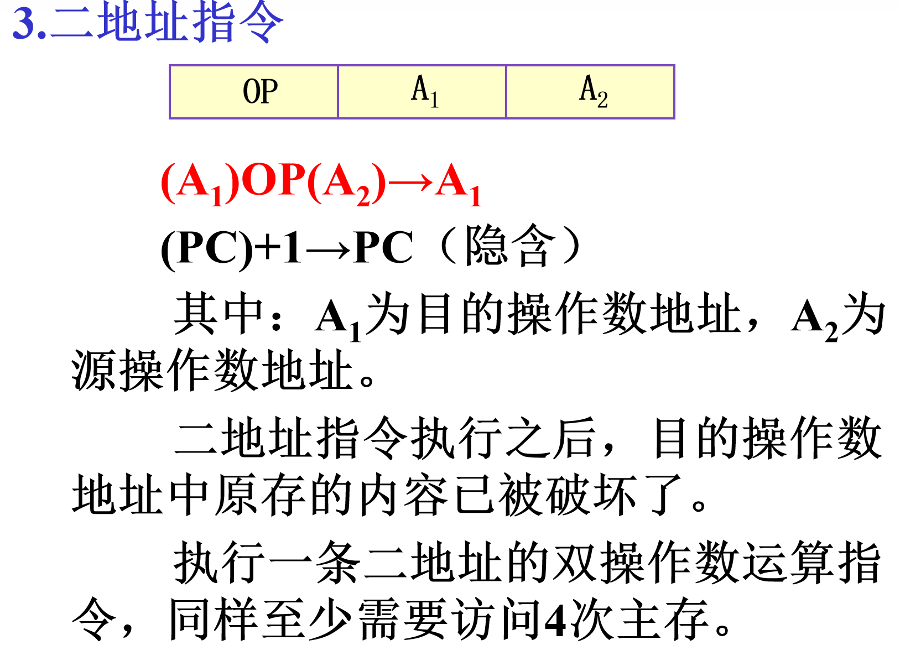
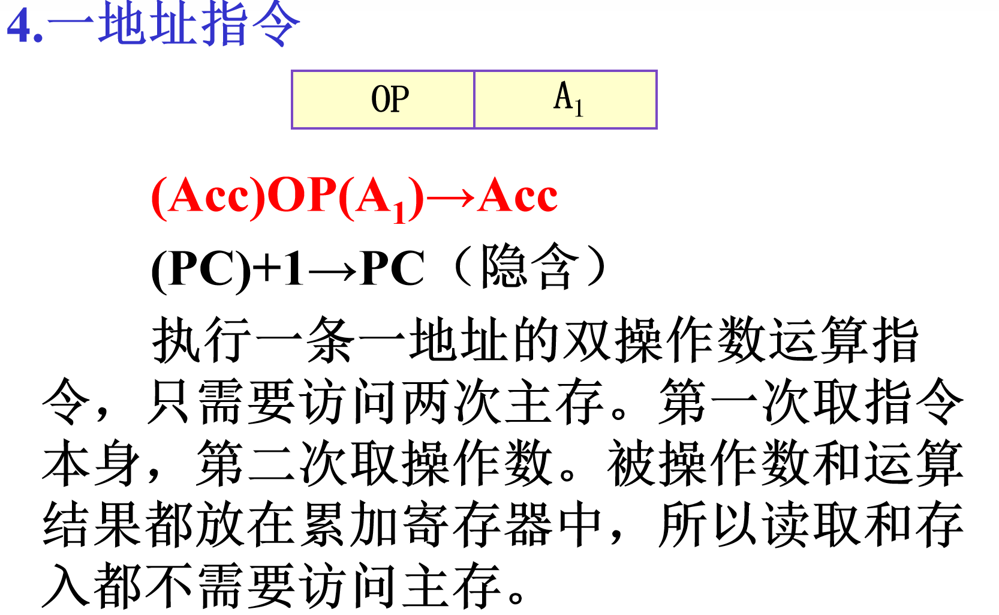
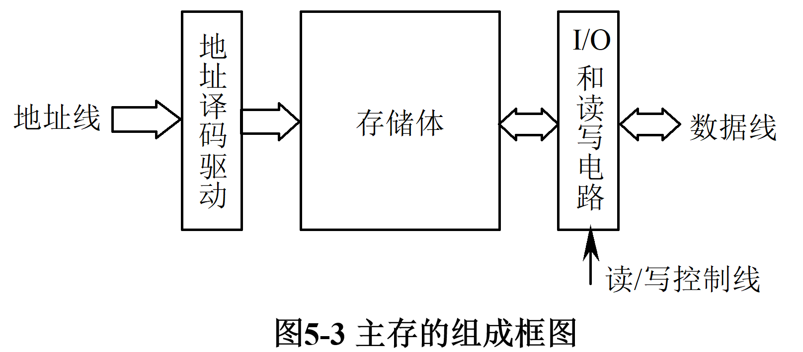
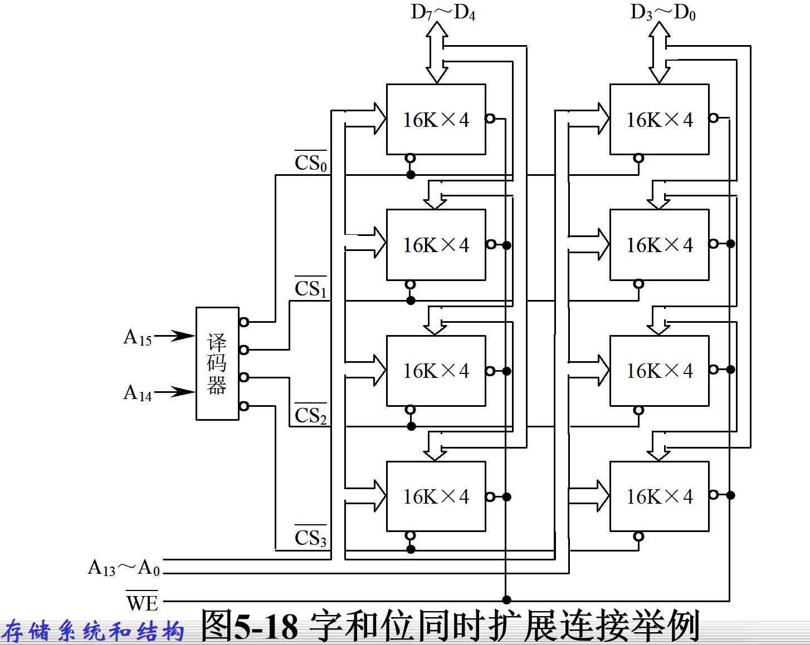
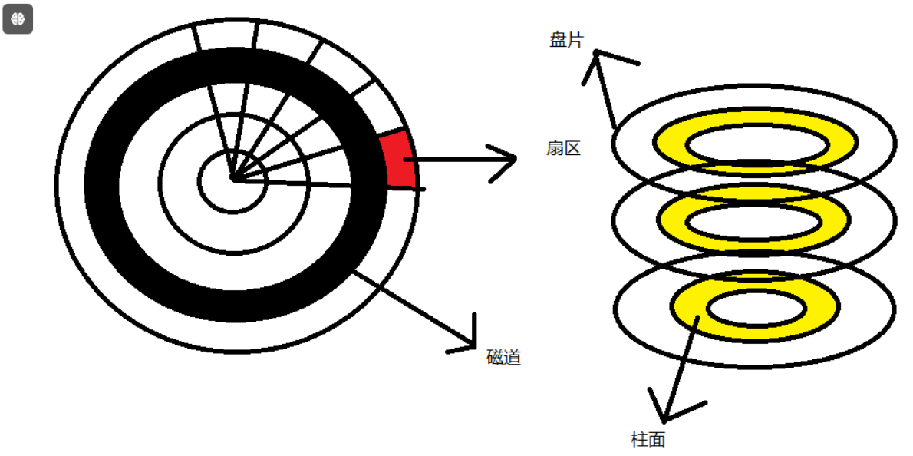

# 计算机组成原理复习

## 叙述

本人是大二GDUT的学生，整理这篇笔记是纯属是临时抱佛脚，主要更适合于学习过一遍这门课程并且需要一个知识大纲的学生，如果您之前没有学习过这门课程希望您可以对照每个知识点看一遍老师的PPT，这样会更好一点。这样比起你每个章节都记录了老师PPT的学习要求。如有错误，请指出🙌。下图附2024年春的计算机组成原理考试范围，本笔记对于==了解==的知识会一概而过或者直接略过，而==理解==和==掌握==的知识点会着重讲述，这其中已经涵盖了考点。

## 每年的考点

2024年春考点：

计算题（2题）：

* 定点数补码、变形补码加减运算
* 磁盘有关参数计算
* 显示器有关参数计算
* 总线带宽等计算

设计分析题（4题）：

* 存储器设计分析，包括选片，字位扩展
* 指令格式、寻址方式设计分析
* 指令系统、指令周期、硬布线控制器、微程序控制器、数据通路、微操作序列设计分析
* 中断优先级设计分析

## 第三章 指令系统

### 3.1 ==指令格式（必考）==

==理解：指令的基本格式以及不同地址码（3、2、1、0地址）的双操作指令的区别==

==理解：规整型指令和非规整型指令的特点==

==理解：扩展操作码的方法（不复习此部分，大家可以去csdn自己去复习）==

1. **指令的基本格式**

2. **不同地址码的双操作指令的区别**

3. **规整型指令和非规整型指令的特点**

规整型指令：操作码字段的位数和位置是固定的

非规整型指令：操作码字段的位数不固定，且分散地放在指令字的不同位置上

### 3.2==寻址技术（必考）==

==掌握：基本的数据寻址和有效地址EA的计算方法==

#### 3.2.3 基本的数据寻址方式

指令中的形式地址A ------>  有效地址EA

操作数：S

1. **立即寻址**：[OP  | 立即数]

2. **寄存器寻址**

* 操作数S与寄存器Ri的关系为：S = (Ri)

3. **直接寻址**

* 指令中的地址码字段给出的地址A就是操作数的有效地址

4. **间接寻址**

* 指令中的地址码字段给出的地址A是==操作数的地址的地址==
* EA = (A)
* S = ((A))

5. **寄存器间接寻址**

* 指令中的地址码是某一通用寄存器的编号，被指定的寄存器中存放着操作数的有效地址
* EA = (Ri)，S = ((Ri))

6. **变址寻址**

* 指令中有含有变址寄存器Rx的地址，和性质地址A
* 把变址寄存器Rx的内容与指令中给出的形式地址A相加，形成有效地址
* EA= （Rx) + A， S = ((Rx) + A)

7. **基址寻址**

* 基址寄存器Rb的内容与指令中给出的位移量D相加，形成有效地址
* EA = (Rb) + D

8. **相对寻址**

* 相对寻址是基址寻址的一种变通，由程序计数器PC提供基址值，指令中的地址码字段作为位移量D
* EA = (PC) + D

9. **页面寻址**
10. **先变址后间址**

* 先变址运算，其运算结果作为简介地址

* EA = (A + (Rx))， S = ( (A + (Rx)) ) 

11. **先间址后变址**

* 将指令中的地址码先进性一次间接寻址，然后再与变址值进行运算
* EA = (A) + (Rx)，S = ( (A) + (Rx) )

12. **基址变址寻址**

* 有效地址是由基址寄存器中的值、变址寄存器中的值和位移量三者相加求得
* EA = （Rb） + （Rx） + D

## 第五章 存储系统和结构

### 5.1 存储系统的组成

了解：存储器的分类方法和存储系统的层次

### 5.2 主存储器的组织

==理解：主存储器的基本结构、存储单元和主存储器的主要技术指标==

==掌握：数据在主存中的存放方式==

1. 主存储器的基本结构

* 主存通常由存储体、地址译码驱动单路、I/O和读写电路组成

2. 存储单元

3. 主存储器的主要技术指标

* 存储容量
* 存取速度
  * 存取时间：从启动一次存储器操作到完成该操作所经历的时间
  * 存取周期：主存进行一次完整的读写操作所需的全部时间，即连续两次访问存储器操作之间所需要的最短时间。
  * 主存带宽：又称为数据传输率，表示每秒从主存进出信息的最大数量，单位为字每秒或字节每秒或位每秒。
* 可靠性：在规定时间内，存储器无故障读写的概率。
* 功耗：反映了存储器件耗电的多少

4. 数据在主存中的存放方式

* 不浪费存储器的存放方法：数据一个紧接一个的存放
* 从存储字的起始位置开始存放的方法
* 边界对齐的数据存放方法：

### 5.3 半导体随机存储器和只读存储器

了解：半导体随机存储器（静态RAM和动态RAM）的基本存储原理

理解：动态RAM的刷新

了解：RAM芯片的基本结构

理解：各种不同类型的ROM

==主存储器通常可分为RAM和ROM两大部分。RAM可读可写，ROM只能读不能写。==

1. 静态RAM和动态RAM

RAM又可分为静态RAM，即SRAM和动态RAM，即DRAM

* SRAM：存取速度快，但集成度低，功耗也较大。所以一般用来组成高速缓冲存储器和小容量主存系统。

* DRAM：集成度高，功耗小，但存储系统满。一般用来组成大容量主存系统。

2. 动态RAM的刷新（区分刷新和重写的概念）

* 刷新间隔：2ms或者4ms

* 刷新方式

  * 集中刷新方式：优点：读写操作时间不受刷新工作的影响，因此系统的存取速度比较高。缺点：集中刷新期间必须停止读写。
  * 分散刷新方式：
  * 异步刷新方式

  

​	

* 刷新控制：为了控制刷新，往往需要增加刷新控制电路。

3. RAM芯片的基本结构

RAM芯片通过地址线（单向）、数据线（双向）和控制线与外部连接

4. 各种不同类型的ROM

* 掩膜式ROM（MROM）：内容由半导体制造厂按用户要求在芯片生产中直接写入，任何人无法改变其内容。优点：可靠性高，集成度高，形成批量后价格便宜。缺点：用户对制造厂依赖过大，灵活性差。
* 一次可编程ROM（PROM）：允许用户利用专门的设备（编程器）写入自己的程序，一旦写入无法改变。
* 可擦除可编程ROM（EPROM）：用户可以利用编程器写入信息，而且可以对齐内容进行多次改写。其可分为两种：紫外线擦除（UVEPROM）和电擦除（EEPROM）。

* 闪速存储器：既可在不加电的情况长期保存信息，又能在线进行快速擦除与重写。兼备EPROM和RAM的优点。

### 5.4 主存储器的连接与控制

==掌握：主存储器容量的各种扩展方式==

==理解：主存储器和CPU的硬连接==

1. 位扩展

如用64K × 1的SRAM的芯片组成64K × 8 的存储器，所需芯片数为：8

* 8个芯片的地址线A15 ~ A0分别连在一起
* 各芯片的片选信号~~CS~~以及读写控制信号~~WE~~也都分别连接到一起
* 只有数据线D7 ~ D0 各自独立，每片代表一位

2. 字扩展

用16K × 8的SRAM组成的64K × 8的存储器，所需芯片数为：4

* CPU提供16根地址线，8根数据线；存储芯片仅有14根地址线，8根数据线
* 四个芯片的地址线A13 ~ A0 、数据线D7 ~ D0 及读写控制信号~~WE~~ 都是同名信号并联在一起
* 高地址线A15 、A14 经过一个地址译码器产生四个片选信号~~CS~~i ，分别选中四个芯片中的一个

3. 字和位同时扩展

**主存和CPU之间的连接**

主存和CPU的硬连接由3组连线：

1. 地址总线(AB)
2. 数据总线(DB)
3. 控制总线(CB)

MAR：可以接受来自程序计数器（PC）的指令地址或来自运算器的操作数地址，以确定要访问的单元

MDR：向主存写入、读出的数据的缓冲部件

主存和CPU之间的软连接：CPU向主存发出的读或写命令，这才是两个部件之间的有效工作的关键。

## 第六章 中央处理器

### 6.1 中央处理器的功能和组成

==理解：CPU的功能和主要寄存器==

CPU的功能：对指令流和数据流在时间与空间上实施正确的控制

CPU的主要寄存器：

1. 通用寄存器
   * 累加寄存器
2. 专用寄存器
   * 程序计数器（PC）
   * 指令寄存器（IR）
   * 存储器数据寄存器（MDR）
   * 存储器地址寄存器（MAR）
   * 状态标志寄存器（PSWR）

### 6.2 控制器的基本组成

==理解：控制器的基本组成==

#### 6.2.1 控制器的基本组成

1. 指令部件：完成取值并分析指令。
2. 时许部件：产生一定的时序信号。
3. 微操作信号发生器：也称为控制单元（CU）。
4. 中断控制逻辑：用来控制中断处理的硬件逻辑。

### 6.3 时序系统与控制方式

==理解：时许系统中指令周期、机器周期的概念==

了解：不同的控制方式（同步、异步、联合）

==理解：指令执行的基本过程==

==掌握：取值周期的微操作序列（公共操作）==

指令周期：从取指令、分析取数到执行完该指令所需的全部时间。

机器周期：又称为CPU周期。通常把一个指令周期划分位若干个机器周期。每个机器周期完成一个基本操作。一般机器的CPU周期有**取值周期**、**取数周期**、**执行周期**、**中断周期**等。

​				          ==指令周期 \= i × 机器周期==

#### 6.3.3 指令执行的基本过程

1. 取指令阶段

* (PC) -> MAR, (PC) -> AB(地址总线)
* 由控制单元（CU）经控制总线（CB）向存储器发读命令
* 从主存中取出的指令通过数据总线（DB）送到存储器数据寄存器（MDR）
* 将MDR中的内容送到指令寄存器（IR）
* 将pc+1

2. 分析取数阶段

3. 执行阶段

   

#### 6.3.4 指令的微操作序列(取值周期：公共操作)

1. (PC) -> MAR：PCout 和 MARin 有效，完成PC经CPU内部总线至MAR的操作
2. 向主存发出读命令，记作Read
3. M(MAR) -> MDR：存储器通过数据总线将MAR所指单元的内容（指令）送至MDR
4. (MDR) -> IR：MDRout 和 IRin 有效，将MDR的内容送至指令寄存器IR
5. (PC) + 1 - > PC：PC内容加一

### 6.4 微程序控制原理

==理解：微程序控制的基本概念==

==掌握：微指令编码法特点==

==理解：微程序控制器的组成和工作过程==

==微程序入口地址和后继微地址的形成==

#### 6.4.1 微程序控制的基本概念

1. 微命令和微操作

* 在微程序控制的计算机中，将控制部件向执行部件发出的各种控制命令叫作==微命令==。

* 微命令是微操作的控制信号，微操作是为命令的操作过程。

2. 微指令和微地址

* ==微指令==是指控制存储器中的一个单元的内容，即控制字
* 存放控制字的控制存储器的单元地址成为==微地址==
* 一条微指令通常包含两部分：
  * 操作控制字段：又称操作码字段，用于产生某一步所需的各微操作控制信号；
  * 顺序控制字段：又称微地址码字段，用以控制产生下一条执行的微指令地址。

## 第七章 总线

###  7.1 总线概述

==理解：总线的基本概念==

了解：总线的分类

❗有考点==掌握：总线的性能指标==

1. 总线：总线是一组能为多个部件**分时共享**的公共信息传送线路。

2. 总线的分类：

* 按功能层次分类：
* * 片内总线
  * 系统总线
  * 通信总线
* 按数据线的多少分类：
* * 并行总线
  * 串行总线

3. 总线的性能指标

* 总线宽度：总线的线数
* ==总线带宽（必考其计算）==：总线的最大数据传输率，即每秒传输的字节数。

其公式为： B = W × F / N

其中：W为数据总线宽度，通常以字节为单位；F为总线的时钟频率，N为完成一次数据传送所用的时钟周期数。

* 总线负载：连接在总线上的最大设备数量。
* 总线复用：在不同时段利用总线上同一个信号线传送不同信号。
* 总线猝发传输

### 7.2 总线仲裁

==理解：总线集中仲裁方式==

总线仲裁：按照一定的优先次序来决定哪个部件首先使用总线

1. 集中仲裁方式

## 第八章 外部设备

### 8.1 外部设备的分类

了解：外部设备分类

* 输入输出设备
* 辅助存储器
* 终端设备
* 过程控制设备

### 82. 磁介质存储器的性能和原理

了解：磁介质存储器的读写原理和技术指标

==理解：常见的数字磁记录方式==

#### 8.2.2 ==磁介质存储器的技术指标（半个考点）==

**后面硬盘的技术参数会用到本节的知识点，可以先跳过这里，复习到8.3.4再回头看这里**

1. **记录密度**：磁介质存储器上单位长度或单位面积存储的二进制信息量
   * 道密度：是指垂直于磁道方向上单位长度中的磁道数目，道密度的单位是==道/in或道/mm==
   * 位密度：是，位密度的单位是==位/in或位/mm==

2. **存储容量**：整个磁介质存储器所能存储的二进制信息的总量，一般以字节位单位表示，与存储介质的尺寸和记录密度直接相关。
3. **平均存取时间**：当磁头接到读写命令后，从原来的位置移动到指定位置并完成读写操作的时间叫作存取时间。

* 存取时间包括4部分：寻道时间(磁头移动道目的磁道)、等待时间（等待被访问的扇区旋转到磁头）、读写操作时间、磁盘控制器的开销。

4. **数据传输率**：磁盘存储器在单位时间内向主机传送数据的位数或字节数，==称为数据传输率Dr，单位位b/s或B/s==

5. **误码率**：衡量磁介质存储器出错概率的参数，等于读出的出错信息位数和读出总的信息位数之比。

常见的数字磁记录方式：

* 直接记录方式
* 按位编码记录方式

* 成组编码记录方式

### 8.3 磁介质存储设备

==理解：硬盘上的信息分布和磁盘地址==

了解：磁盘阵列的基本概念

#### 8.3.3 硬盘的信息分布和磁盘地址

1. **硬盘的信息分布**

   * 记录面

   * 圆柱面

   * 磁道

   * 扇区

   

2. **磁盘地址**

磁盘地址一般表示为

* 驱动器号、圆柱面（磁道）号、记录面（磁头）号、扇区号

#### 8.3.4 ==硬盘存储器的技术参数(2024年春考点)==

==考点：磁盘有关参数计算==

1. **硬盘的主要性能指标**
   * 硬盘容量
   * 主轴转速
   * 道密度
   * 平均存取时间
   * 缓存
   * 数据传输率

2. **硬盘参数计算**

设有一个盘面直径为18in的磁盘组，有20个记录面，每面有5in的区域用于记录信息，记录密度为100道/in，和1000b/in，转速为2400r/min，道间移动速度为0.2ms，试计算该磁盘组的容量、数据传输率和平均存取时间。

题干中各参数解析：

* 18in：
* 100道/in：道密度为100道/in，是指垂直于磁道方向上单位长度中的磁道数目。

**每一面记录面的磁道数N为：**

​	N = 5in × 100 道 /in = 500道/面

**最内圈磁道的周长为：**

​	L = pai × (18 - 2× 5) in = 25.12in

**以最内圈磁道的周长作每条磁道的长度，故该磁盘组的存储容量为：**

​	C = 1000b/in × 25.12道 × 500道/面 × 20面 = 31.4 × 106B

**磁盘旋转一圈的时间为：**

​	t = 1 / 2400r/min × 60 s/min = 25ms

**数据传输率为：**

​	Dr = 每一圈的容量 / 旋转一圈的时间 = 25120b / 25ms = 1004.8 b/ms = 1.0048 × 106 b/s

**平均存取时间为：**

​	

寻道时间Tsmax = 0.2 × 499ms

等待时间Twmax = 25 ms 

### 8.4 磁盘阵列（RAID）

了解：磁盘阵列的基本概念

RAID：可以把RAID理解成一种使用磁盘驱动器的方法，他将一组磁盘驱动器用某种逻辑方式联系起来，作为逻辑上的一个磁盘驱动器来使用。

### 8.5 光盘存储器

了解：光盘的基本概念

光盘：用光学方式读写信息的圆盘成为光盘。

### 8.6 新型辅助存储器

了解：新型辅助存储器

### 8.7 键盘输入设备

==理解：键盘的类型和非编码键盘的工作原理==

### 8.8 其他输入设备

了解：其他输入设备

### 8.9打印输出设备

### 8.10 ==显示设备（2024年春考点）==

==理解：显示设备特点和字符显示器的工作原理==

#### 8.10.3 字符显示器的工作原理

## 第九章 输入输出系统

#### 9.1 主机与外部的连接

了解：接口的基本组成、接口和端口概念

接口的组成：

